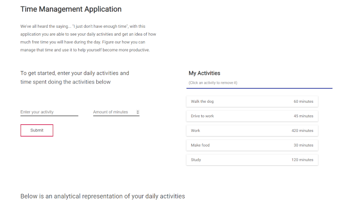
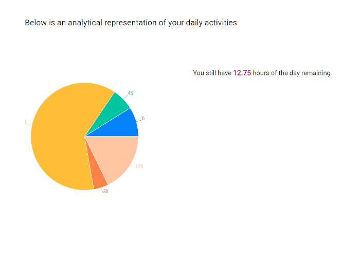

# Time Management App
Built with React

This project is designed to help people manage their time better, the application will allow you to enter all tasks done during the day and then the amount of time it takes to do that task.

Once the tasks have been entered you will then get an analytical representation of your time spend during the day on a chart. The aim of this is that you will then be able to see where you are spending the majority of your time each day and then be able to plan better to get more done in your day.

Once all daily tasks have been entered you will then get a return showing how much time of the day you will have spare, with this time you will be able to see how you can plan your days better to accommodate additional activities

